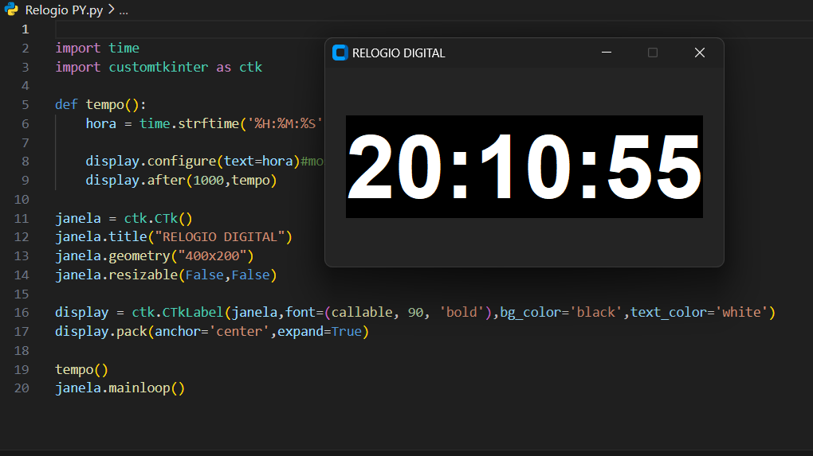

## Relógio Digital em Python com CustomTkinter

### Descrição

Este script Python cria um simples relógio digital utilizando a biblioteca CustomTkinter. A interface gráfica é construída com o objetivo de apresentar a hora atual de forma clara e concisa.

